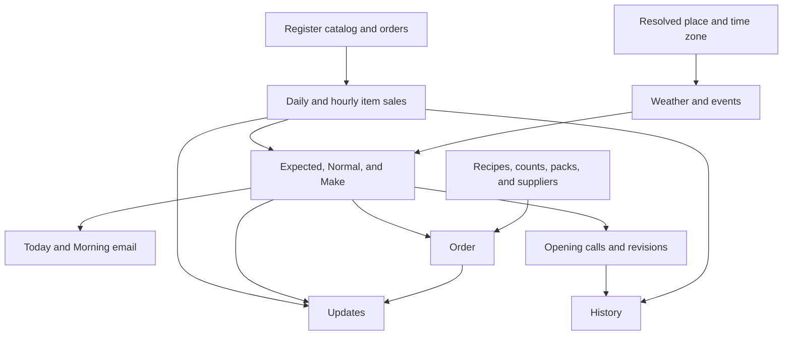

# Quantify architecture

Contracts reviewed September 13, 2026.

## Runtime and application

The local application uses Python, SQLite with WAL, browser JavaScript, and responsive HTML/CSS. It has no npm runtime or browser framework. `server.py` serves static files and JSON routes. Operating queries are scoped to an authenticated organization and location.



The browser has five destinations: Today, Order, History, Updates, and Settings. `web/app.js` owns application state, navigation, sheets, and forms. `web/updates.js` owns feed requests, receipt state, notification timing, and feed rendering through callbacks. `web/index.html` loads `api.js`, `updates.js`, and `app.js` as ordered deferred scripts.

## Ingestion and location context

Register catalog variations retain stable `pos_item_id` values and raw labels. `menu_intelligence.py` creates readable interpretations without replacing the register's identity. Text import requires a usable price and does not overwrite register-owned items.

`pos_order_lines` is the normalization boundary for provider, order, and line identity. A changed order replaces its normalized lines and rebuilds affected daily and hourly aggregates. The application retains register order records. Where only aggregates are available, reconstructed ticket detail is labelled as rebuilt.

Square webhooks verify the signature over the public notification URL and exact raw body before processing. Provider configuration and retention determine which history can be synchronized.

Time zones govern trading dates, forecast dates, history, supplier cutoffs, and email schedules. Geography and time zone resolution are separate facts. A matched place point can support local context; an unresolved place cannot silently reuse default coordinates. Weather and event records must match the queried geography before use. [Personalization](PERSONALIZATION.md) describes coverage, source dates, and missing-context behavior.

The resolver uses exact normalized city/state matches from the 2025 US Census place reference. A resolved place has `geography_status="city"`; unsupported or ambiguous places remain `"unverified"`. Existing coordinates without provenance are repaired from the saved place, with prior values retained in a setting. Event attendance and distance each carry provenance: missing values are exposed as `null`, venue capacity is not attendance, and provider rank is not a crowd count.

## Forecast and cache contracts

`intelligence.py` combines a same-weekday baseline, regularized regression, and comparable historical days. Held-out history determines component weights. Each item returns whole-unit expected sales, a comparable baseline, a likely range, confidence, evidence, and preparation detail.

The `expected` and `model_expected` fields describe predicted sales. `baseline` describes normal sales. `make` describes preparation. A saved override changes Make exactly, including zero, without moving the sales prediction or its comparison. Override records include item, date, quantity, optional reason, author, and time.

An item with fewer than seven selling days has `new_item=true`. The UI shows that it has no number yet. Forecast totals and ingredient demand exclude those rows. A location without history returns an explicit empty state.

The reusable function is:

```python
daily_brief(conn, location_id, target_date, week_days=7,
            data_version=None, refresh=False)
```

Its cache is bounded to 96 entries with a five-minute lifetime. The key includes database identity, location, date, requested horizon, data version, and model version. The data version reflects relevant sales, hourly sales, menu, location, integrations, settings, weather, events, overrides, counts, purchase orders, scores, cost assumptions, and recipes. In-process locks share a build for the same cache shard. Callers receive deep copies, so attaching costs or live state cannot mutate a cached result. `refresh=True` rebuilds the brief; it does not synchronize the register.

Separate bounded caches hold training context and item models. Saved food-cost, staffing, or recipe changes rebuild the brief immediately, including edits within one timestamp, without changing the training version or refitting an unchanged sales model. Overrides likewise do not require retraining. Database identities distinguish files and in-memory connections.

`forecast_runs` stores a result once per location, target date, model version, and data version. A unique index and INSERT OR IGNORE prevent repeated page reads from accumulating identical runs. This run log is separate from the opening forecast used for scoring.

## Opening calls, revisions, and history

`intraday.py` saves an opening call only before service on the location's current trading date. A forecast generated after opening cannot be relabelled as a morning prediction. Once saved, the opening call is retained. Intraday revisions separately record changes as completed sales slots arrive.

`transactions.py` scores completed days against opening calls where available. Otherwise it rebuilds a comparison from prior observations and records `call_source="reconstructed"`. Later revisions are described separately from opening accuracy. Scoring and day detail use the same rounded item quantities.

`item_analysis.py` reads the same historical Expected for the item sheet: a stored opening call first, then the rounded scored History value. The item's `today` object carries source, label, and recorded time, with `recomputed_expected` keeping current reanalysis separate. Preparation figures and saved quantity overrides do not replace the historical call.

History Days uses calendar pagination. Its default page starts yesterday and includes dates without sales; next_before is exclusive. Day detail identifies closed days and avoids generating a sales review for them. Register receipts and reconstructed orders expose their source.

## Recipes and supply

`item_composition` stores suggested or owner-confirmed recipe parts. Opening Menu queues missing recipes in the background and immediately returns existing rows with `pending_compositions`. The browser polls only while the same location's Menu tab remains active. An owner's saved recipe wins over a late generated result. Valid saved shares total between 95 and 105 inclusive.

`ordering.py` multiplies usable recipe quantities by Make across the selected dates. Ingredients without usable quantities remain in a review backlog. `supply.py` adds suppliers, packs, saved shelf counts, recorded incoming orders, and local delivery/cutoff rules. Common base units keep mass, volume, and counted units consistent. Pack purchases round only after a valid pack is configured.

Counts distinguish zero from unknown. Empty/null clears a count; zero stores an empty shelf. The count response includes recalculated order lines for immediate UI replacement. Supply attention uses a bounded cache and invalidates it after supplier, pack, count, or order changes.

Purchase order channels have distinct outcomes. Server email records the provider result, including failed and outbox states. A mail-app request without confirmation returns a draft and writes no order. Confirmation records it as sent by the operator. A site request records the operator's confirmation of external placement. Copying is not an order channel. Only eligible recorded deliveries reduce the remaining buying requirement.

Supplier websites and curated names are contact aids. Their presence does not establish a direct supplier API connection.

## Updates persistence and lifecycle

`quantify_app/updates.py` derives observations from the current brief, supply attention, and aggregate item/time sales. It does not use customer identity. Repeated time patterns require multiple comparable weekdays and expire when their service window ends.

| Table | Responsibility |
| --- | --- |
| operating_updates | Location facts, evidence, action, effective window, rank, and resolution |
| operating_update_receipts | Per-user shown and read timestamps |
| operating_update_checks | Last check time and review mode for each location |

Stable note IDs let refresh update observations without losing receipts. Notes absent from a later refresh become resolved. Feed state is active, scheduled, expired, or resolved. The unread count includes active and scheduled notes. Earlier notes remain readable in a bounded history response.

GET refreshes observations when the last check is more than five minutes old. Explicit refresh bypasses that interval and can use the optional writing service to rank supplied observation IDs. It cannot invent a title, quantity, claim, deadline, or action. Concurrent checks use an in-flight claim guard.

The feed provides an important `notification` and an optional `timely_notification` for an active pattern. Opening and visibility-return reads consider only important notices. A visible session's five-minute poll may consider the timely field too. The browser rechecks expiry, defers while a sheet or typing is active, and displays one corner notice at most. It records `read:false` only after display, suppressing a repeat while leaving the note unread. Explicit read actions persist `read:true`.

`QuantifyUpdates.create` receives transport, context, and rendering/navigation callbacks. Its load, panel, start, stop, and reset methods do not access application state directly. Request epochs and user/location keys discard late responses. Reset clears the old badge and feed; the app follows it with a new-context load. Stopping removes listeners, timers, and the notice. Local expiry timers prevent stale notices and badges surviving until the next poll.

## Costs, email, and external services

Cost estimates combine recipe/category food shares, staffing assumptions, owner-entered pay and employer payroll costs, and recurring expenses. Missing labor inputs produce unknown amounts and incomplete totals. Dated wage references are review material, not inferred payroll. [Personalization](PERSONALIZATION.md) documents sources and owner override rules.

Morning email uses the location's time zone and saved send time. The local scheduler checks due messages while the application runs and records delivery attempts. Without a provider it writes an email outbox artifact. A saved message is not a delivered message. A hosted service needs an always-running worker and delivery monitoring.

The numeric forecast operates locally. Optional writing services supply structured narrative, suggested recipes, or observation ranking, with deterministic local fallbacks. Cached writing and in-flight guards avoid duplicate work. External provider readiness is reported separately from local functionality.

The optional model is configurable; model selection is not a finalized product promise. The transport uses a 45-second timeout and disables SDK retries. Composition and Updates calls explicitly carry their location ID for spend attribution.

`budget.py` keeps completed-call token usage and estimated cost in `ai_spend`. Before another request, the application checks a $6 monthly recorded-spend threshold, 12 recorded forced generations per UTC day, and an estimated 60,000-token payload limit. A blocked, unavailable, or failed writing call uses the local fallback so the operating information remains available.

This is a soft spend guard, not a guaranteed provider billing cap. It accounts for completed calls, has no atomic reservation for concurrent requests, and cannot fully account for billed failures or discrepancies in model pricing and usage. Provider-side limits and actual invoice monitoring remain necessary for a hard spending boundary. See [Constitution](CONSTITUTION.md) for the product's limits and cost assumptions.

## Authentication and billing

Account setup verifies email before workspace access. TOTP is optional. Passwords use salted PBKDF2-HMAC-SHA256; session bearer tokens and recovery codes are stored as hashes. The application must retain TOTP secrets to verify codes. Production secret storage and deployment controls remain operational responsibilities.

Authenticated mutations require the session CSRF token. Location routes verify ownership through the session's organization. Public authentication, showcase, time zone, health, and provider webhook routes have their own boundaries. See [API reference](API_REFERENCE.md).

`billing.public_catalog` supplies the public page and Account plans. Capacity is checked inside the location creation transaction; limits do not erase existing locations or history. Trial selection preserves dates. Paid changes use the provider portal, and checkout remains pending until a signed provider event arrives. Stripe signatures and configured price, currency, and recurrence are checked before applying commercial state. Legacy offers retain their terms. See [Pricing decision](PRICING_DECISION.md).

## Database groups

The current core schema version is 8. Initialization adds missing declared columns and runs pending versioned migrations. Geography, context provenance, and payroll provenance columns are additive. Updates and spend-ledger modules ensure their own tables before use.

| Area | Main tables |
| --- | --- |
| Workspace | organizations, locations, settings, integrations |
| Register and menu | menu_items, menu_interpretations, sales, sales_hourly, `pos_order_lines`, pos_orders, `item_composition` |
| Context and forecasts | weather, events, context_daily, forecast_overrides, `forecast_runs`, forecast_calls, forecast_revisions, day_accuracy |
| Supply | suppliers, supplier_items, stock_counts, purchase_orders |
| Costs | cost_settings, category_costs, recurring_costs |
| Updates | operating_updates, operating_update_receipts, operating_update_checks |
| Writing and email | ai_generations, `ai_spend`, email_preferences, email_deliveries |
| Account and billing | users, sessions, auth_challenges, email_verifications, recovery_codes, security_events, subscriptions, billing_events, cancellation_feedback |

## Local verification

Use a copied database selected with QUANTIFY_DB for experiments. QUANTIFY_AUTH_BYPASS=1 is a local QA convenience. QUANTIFY_DISABLE_SCHEDULER=1 disables background scheduler work. Run `node --check web/app.js`, `node --check web/updates.js`, and `python -m pytest tests/ -q` for source and contract checks. Browser QA should cover actual API integration as well as delayed fixture responses, context changes, read persistence, expiry, and touch layouts. Identify fixture screenshots as fixtures.
